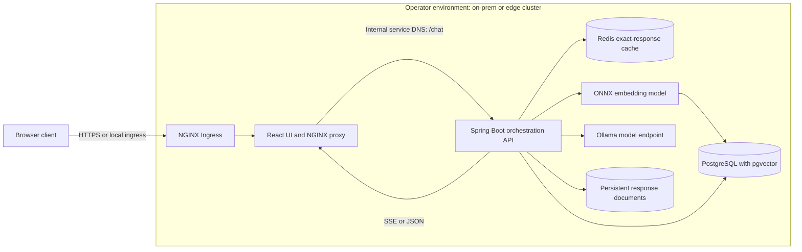

# PrismAI High-Level Design

## Objective

PrismAI places an intent- and retrieval-aware orchestration layer between clients and response-generation models. Its goal is to select a suitable serving path for each request, reuse prior work where appropriate, and support deployments where inference and data services are operated within an organization's own environment.

## System Context

The browser communicates with the UI origin. The frontend proxy forwards API traffic over Kubernetes service DNS, keeping the backend Service private to the cluster. PostgreSQL/pgvector, Redis, Ollama, model resources, and response-document storage are configurable so the operator can place them according to the target environment.

## Design Drivers

- Minimize calls to response-generation models when an exact or semantically reusable response is suitable.
- Separate intent classification from response generation so routing can choose among reuse, SLM, and LLM strategies.
- Keep model endpoints and data-service locations under deployment configuration.
- Preserve response provenance and routing metadata for observability and evaluation.
- Support incremental response delivery through SSE.

## Major Components

| Component           | Responsibility                                                                                         |
| ------------------- | ------------------------------------------------------------------------------------------------------ |
| Chat API            | Accepts chat requests and returns JSON or SSE                                                          |
| Chat orchestrator   | Coordinates cache lookup, embedding search, intent classification, provider selection, and persistence |
| Redis cache         | Returns responses for exact repeated queries                                                           |
| Embedding service   | Creates query vectors with a local ONNX transformer model                                              |
| pgvector store      | Finds semantically similar stored queries and stores query metadata                                    |
| Intent classifier   | Labels a cache miss as static factual, real-time dynamic, or complex reasoning                         |
| Provider strategies | Isolates response retrieval/generation behind a common interface                                       |
| Document store      | Persists generated response text separately from query metadata                                        |
| React UI and NGINX  | Sends user requests and streams response events from the backend                                       |

## Deployment View

The repository provides separate frontend/backend container builds and a GHCR workflow. The Kubernetes reference deploys the frontend behind an Ingress and exposes the backend only through a `ClusterIP` Service. External dependencies and model files are supplied by the deploying environment. The deployment shape is intended to be adaptable to on-prem and edge clusters; capacity, redundancy, and operational targets must be validated for each deployment.
