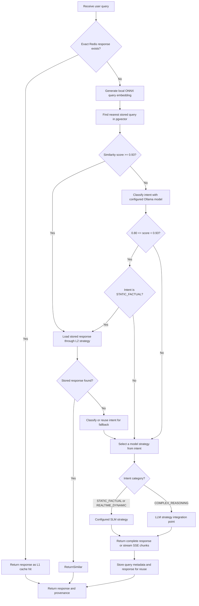

# PrismAI Low-Level Design

## Request Decision Flow

Similarity values are rounded to two decimal places by the current repository query. Routing boundaries (`0.80` and `0.93`) are currently expressed in application logic and should be evaluated against representative request and quality data before tuning.

## Components and Responsibilities

| Type                               | Responsibility                                                                     |
| ---------------------------------- | ---------------------------------------------------------------------------------- |
| `ChatController`                   | Exposes complete-response and SSE endpoints                                        |
| `ChatServiceImplemetation`         | Runs L1 lookup, semantic lookup, classification, routing, and persistence          |
| `ChatServiceState`                 | Carries query, intent, similarity, provider, and token-count state for one request |
| `QueryEmbeddingServiceImpl`        | Embeds incoming queries and persists query/metadata records                        |
| `QueryEmbeddingRepository`         | Inserts query vectors and ranks candidates using pgvector cosine distance          |
| `CacheServiceImplementation`       | Reads/writes exact-query values in the configured Spring cache (Redis)             |
| `QueryResponseStrategyFactoryImpl` | Resolves a provider enum to its registered response strategy                       |
| `SLMResponseStrategy`              | Calls configured Ollama chat endpoint and parses streamed deltas                   |
| `L2CacheResponseStrategy`          | Resolves a stored similar query to its persisted response document                 |
| `LocalFileStorage`                 | Reads and writes response documents under the configured storage root              |

## Routing Rules

1. An exact Redis hit returns immediately and is reported as `L1Cache`.
2. Otherwise, the nearest vector candidate is retrieved.
3. A similarity score of at least `0.93` selects the L2 strategy without intent classification.
4. Below `0.93`, intent classification returns one of `STATIC_FACTUAL`, `REALTIME_DYNAMIC`, or `COMPLEX_REASONING`.
5. For scores from `0.80` to below `0.93`, static factual queries attempt L2 reuse. If the response is absent, the flow falls back to a model strategy.
6. For other misses, static factual and real-time dynamic intents select SLM; complex reasoning selects the LLM strategy.

The provider contract keeps orchestration independent from model integrations. The SLM path is connected to the configured Ollama API. `LLMResponseStrategy` is the current integration point for wiring an organization-selected LLM provider.

## Persistence and Provenance

Generated queries are embedded and stored with metadata such as intent, selected provider, and token count. Generated response text is written to the configured document store using the embedding record identifier. API responses expose provider, intent, nearest query, and similarity score; the SSE completion event carries the final response metadata after token events.

## Streaming Contract

`GET /chat/initiateChat/stream?message=...` returns named SSE events:

| Event      | Payload                       | Purpose                                          |
| ---------- | ----------------------------- | ------------------------------------------------ |
| `token`    | JSON object with `content`    | Adds a text chunk to the in-progress response    |
| `complete` | `ChatResponseDto` JSON object | Signals completion and includes routing metadata |
| `error`    | Error text                    | Reports a request failure                        |

The frontend proxy and Ingress disable buffering so token events can reach the browser incrementally.
