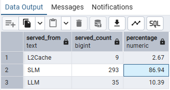
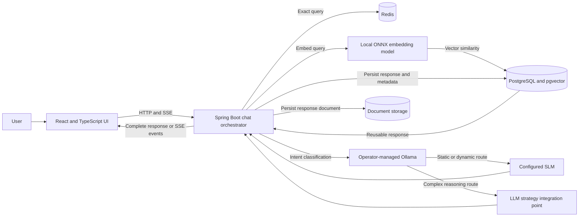

# PrismAI

**Intent-based model routing for private, cost-aware AI workflows.**

PrismAI is a Java and Spring Boot AI gateway prototype that decides how a request should be served before invoking a response-generation model. It combines exact-response caching, semantic retrieval, intent classification, and locally hosted language models to reduce unnecessary generation work while keeping model and data placement under the operator's control.

The central engineering idea is simple: **choose the least expensive suitable response path for each query.** A repeat query may be served from Redis, a sufficiently close semantic match may be reused from pgvector-backed storage, and requests that need new reasoning are routed according to classified intent.

## Why PrismAI

- **Optimize inference spend:** avoid full response generation when an exact or semantically reusable answer is available; use a smaller local model for classification and appropriate response paths.
- **Keep data close to the workload:** connect to operator-managed Ollama, PostgreSQL/pgvector, Redis, model files, and document storage. Organizations choose where these services run.
- **Route by meaning, not only by endpoint:** use intent and similarity signals to distinguish reusable factual requests, dynamic requests, and complex reasoning.
- **Make the decision observable:** return the serving provider, intent, closest stored query, and similarity score with the response.
- **Stream responses:** deliver generated text to the React client incrementally using Server-Sent Events (SSE).
- **Support environment-owned deployment:** build separate frontend and backend images, publish them to GHCR, and deploy through Kubernetes with an Ingress for the UI and an internal-only backend Service.

PrismAI is designed for teams exploring private AI gateways, on-prem inference, and edge-oriented deployments where model placement, response latency, and inference cost are architectural decisions.

## Observed Routing Metrics

The following database aggregate is a snapshot of **337 recorded provider decisions** from the project:

| Serving path | Requests | Share |
| --- | ---: | ---: |
| L2 semantic cache | 9 | 2.67% |
| Small language model (SLM) | 293 | 86.94% |
| Large language model (LLM) | 35 | 10.39% |
| **Total recorded decisions** | **337** | **100.00%** |

## Request Routing

1. Check Redis for an exact query match.
2. On a miss, create a local embedding and search prior queries in PostgreSQL with pgvector.
3. Reuse the closest stored response directly when its rounded similarity score is at least `0.93`.
4. Otherwise, classify intent as `STATIC_FACTUAL`, `REALTIME_DYNAMIC`, or `COMPLEX_REASONING`.
5. For scores from `0.80` to below `0.93`, a static factual query can use the semantic-cache path. Other eligible factual or dynamic requests route to the configured SLM; complex reasoning is directed to the LLM strategy boundary.
6. Store query metadata and, for generated responses, the response document for future reuse.

The thresholds and model settings are configuration/design decisions to evaluate against a workload. The intent-classification step is itself a model call, but it is separated from full response generation so the system can choose a lower-cost route where suitable.

## Architecture

For the high-level system view and detailed routing design, see [HLD](docs/HLD.md) and [LLD](docs/LLD.md). The editable workflow source is [`WorkFlow.drawio`](WorkFlow.drawio).

## Technology

| Area                      | Technologies                                                      |
| ------------------------- | ----------------------------------------------------------------- |
| Backend                   | Java 21, Spring Boot, Spring MVC, Spring Data JPA, Spring AI      |
| Retrieval and persistence | PostgreSQL, pgvector, Redis, filesystem-backed response documents |
| Local inference           | Ollama-compatible model APIs, ONNX transformer embeddings         |
| User interface            | React, TypeScript, Vite                                           |
| Delivery                  | Docker, GitHub Actions, GHCR, Kubernetes, NGINX Ingress           |

## API

| Endpoint                                    | Behavior                                                                  |
| ------------------------------------------- | ------------------------------------------------------------------------- |
| `GET /chat/initiateChat?message=...`        | Returns a complete response and routing metadata                          |
| `GET /chat/initiateChat/stream?message=...` | Emits `token` events followed by a `complete` event with routing metadata |

The Kubernetes frontend proxies `/chat` to the backend's cluster-internal DNS name. The backend is exposed as a `ClusterIP` Service, not through the public Ingress.

## Build and Run

For environment variables, external-service setup, model files, Docker images, and local Kubernetes instructions, see **[BYOE: Bring Your Own Environment](BYOE.md)**. The example configuration is [`k8s/prismai-config.env.example`](k8s/prismai-config.env.example), and deployment manifests are documented in [`k8s/README.md`](k8s/README.md).

## Project Background

The retrieval experiments use the [LMSYS Chatbot Arena Conversations dataset](https://huggingface.co/datasets/lmsys/chatbot_arena_conversations).

## Working Demo
